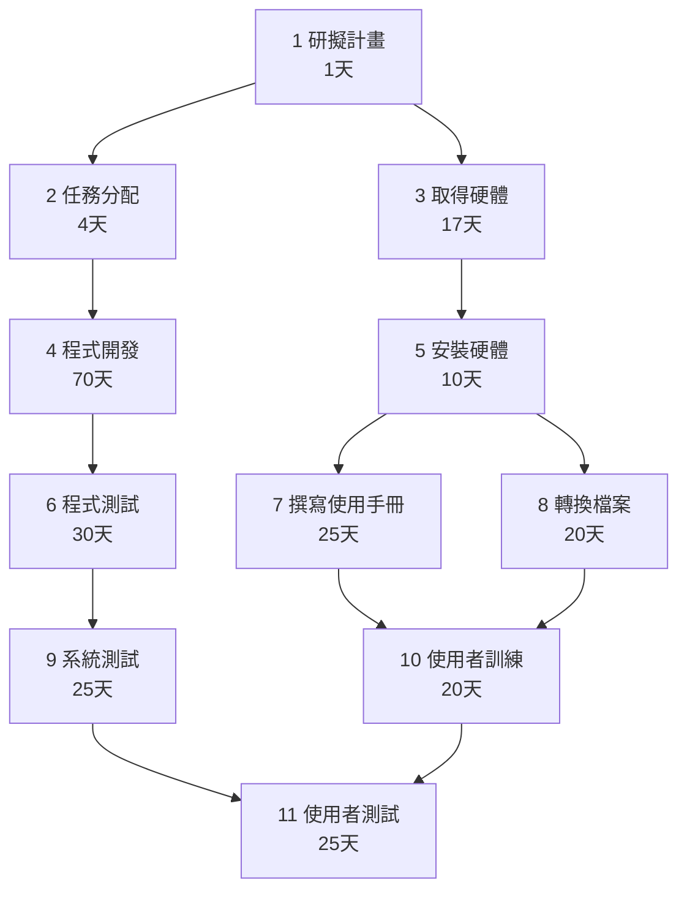
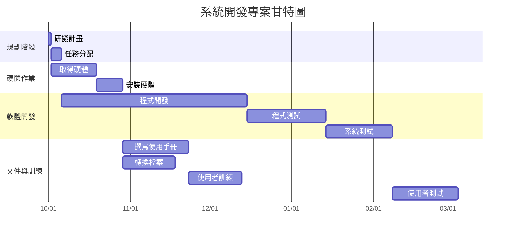

# 系統開發專案：PERT / CPM、甘特圖與關鍵路徑分析

## 🧩 一、任務與依賴模式

| 任務 | 說明 | 前置任務 | 工期 (天) |
|------|------|-----------|-----------|
| 1 | 研擬計畫 | - | 1 |
| 2 | 任務分配 | 1 | 4 |
| 3 | 取得硬體 | 1 | 17 |
| 4 | 程式開發 | 2 | 70 |
| 5 | 安裝硬體 | 3 | 10 |
| 6 | 程式測試 | 4 | 30 |
| 7 | 撰寫使用手冊 | 5 | 25 |
| 8 | 轉換檔案 | 5 | 20 |
| 9 | 系統測試 | 6 | 25 |
| 10 | 使用者訓練 | 7,8 | 20 |
| 11 | 使用者測試 | 9,10 | 25 |

---

## 🕓 二、任務時間表

假設專案從 **2025/10/01** 開始：

| 任務 | 說明 | 前置任務 | 開始日 | 結束日 | 工期(天) |
|------|------|-----------|----------|----------|-----------|
| 1 | 研擬計畫 | - | 10/01 | 10/01 | 1 |
| 2 | 任務分配 | 1 | 10/02 | 10/05 | 4 |
| 3 | 取得硬體 | 1 | 10/02 | 10/18 | 17 |
| 4 | 程式開發 | 2 | 10/06 | 12/14 | 70 |
| 5 | 安裝硬體 | 3 | 10/19 | 10/28 | 10 |
| 6 | 程式測試 | 4 | 12/15 | 2026/01/13 | 30 |
| 7 | 撰寫使用手冊 | 5 | 10/29 | 11/22 | 25 |
| 8 | 轉換檔案 | 5 | 10/29 | 11/17 | 20 |
| 9 | 系統測試 | 6 | 2026/01/14 | 2026/02/07 | 25 |
| 10 | 使用者訓練 | 7,8 | 11/23 | 12/12 | 20 |
| 11 | 使用者測試 | 9,10 | 2026/02/08 | 2026/03/04 | 25 |

---

## (1) 📈 PERT / CPM 圖



---

## (2) 📊 甘特圖



---

## (3) 🔴 關鍵路徑分析 (Critical Path)

**關鍵路徑：**
```
1 → 2 → 4 → 6 → 9 → 11
```

| 任務 | 工期(天) |
|------|-----------|
| 1 | 1 |
| 2 | 4 |
| 4 | 70 |
| 6 | 30 |
| 9 | 25 |
| 11 | 25 |
| **合計** | **155 天** |

📌 **關鍵路徑長度：155 天**  
任何位於此路徑的任務延誤都會導致整體專案延遲。

---

_此文件可直接放入 GitHub README.md 中，支援 Mermaid 顯示。_
