---

## (1) 📈 PERT / CPM 圖

```mermaid
flowchart TD

A1[1 研擬計畫<br>1天] --> A2[2 任務分配<br>4天]
A1 --> A3[3 取得硬體<br>17天]
A2 --> A4[4 程式開發<br>70天]
A3 --> A5[5 安裝硬體<br>10天]
A4 --> A6[6 程式測試<br>30天]
A5 --> A7[7 撰寫使用手冊<br>25天]
A5 --> A8[8 轉換檔案<br>20天]
A6 --> A9[9 系統測試<br>25天]
A7 --> A10[10 使用者訓練<br>20天]
A8 --> A10
A9 --> A11[11 使用者測試<br>25天]
A10 --> A11
```



---

## (2) 📊 甘特圖

```mermaid
gantt
    title 系統開發專案甘特圖
    dateFormat  YYYY-MM-DD
    axisFormat  %m/%d

    section 規劃階段
    研擬計畫          :a1, 2025-10-01, 1d
    任務分配          :a2, after a1, 4d

    section 硬體作業
    取得硬體          :a3, after a1, 17d
    安裝硬體          :a5, after a3, 10d

    section 軟體開發
    程式開發          :a4, after a2, 70d
    程式測試          :a6, after a4, 30d
    系統測試          :a9, after a6, 25d

    section 文件與訓練
    撰寫使用手冊      :a7, after a5, 25d
    轉換檔案          :a8, after a5, 20d
    使用者訓練        :a10, after a7 a8, 20d
    使用者測試        :a11, after a9 a10, 25d
```



---

## (3) 🔴 關鍵路徑分析 (Critical Path)

**關鍵路徑：**
```
1 → 2 → 4 → 6 → 9 → 11
```

| 任務 | 工期(天) |
|------|-----------|
| 1 | 1 |
| 2 | 4 |
| 4 | 70 |
| 6 | 30 |
| 9 | 25 |
| 11 | 25 |
| **合計** | **155 天** |

📌 **關鍵路徑長度：155 天**  
任何位於此路徑的任務延誤都會導致整體專案延遲。

---

_此文件可直接放入 GitHub README.md 中，支援 Mermaid 顯示。_
