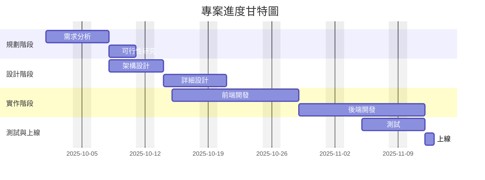

```mermaid
gantt
    title 專案進度甘特圖
    dateFormat  YYYY-MM-DD
    excludes    weekends

    section 規劃階段
    需求分析           :a1, 2025-10-01, 5d
    可行性研究         :a2, after a1, 3d

    section 設計階段
    架構設計           :b1, 2025-10-08, 4d
    詳細設計           :b2, after b1, 5d

    section 實作階段
    前端開發           :c1, 2025-10-15, 10d
    後端開發           :c2, after c1, 10d

    section 測試與上線
    測試               :d1, 2025-11-05, 5d
    上線               :d2, after d1, 1d
```
