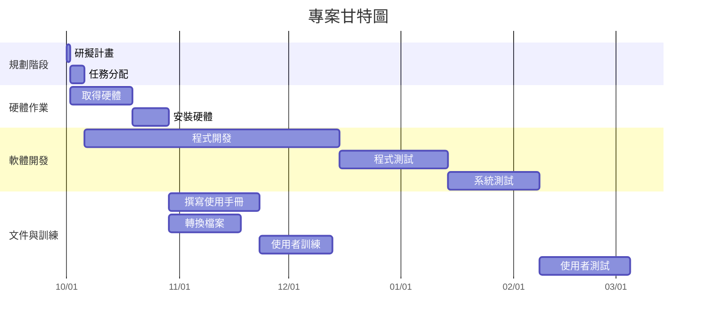

```mermaid
flowchart LR
    A1([1 研擬計畫<br>1天]) --> A2([2 任務分配<br>4天])
    A2 --> A4([4 程式開發<br>70天])
    A4 --> A6([6 程式測試<br>30天])
    A6 --> A9([9 系統測試<br>25天])
    A9 --> A11([11 使用者測試<br>25天])

    %% 標註開始與結束
    start([開始]) --> A1
    A11 --> end([結束])

    %% 標示關鍵路徑
    classDef critical fill=#f66,stroke=#333,stroke-width=2px,color=white;
    class start,end,A1,A2,A4,A6,A9,A11 critical;
```
